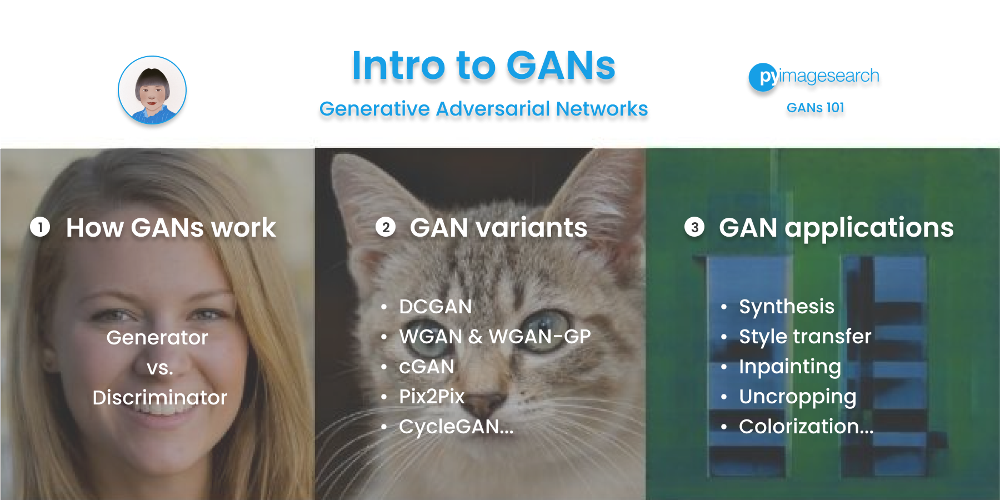
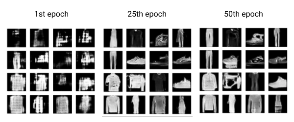
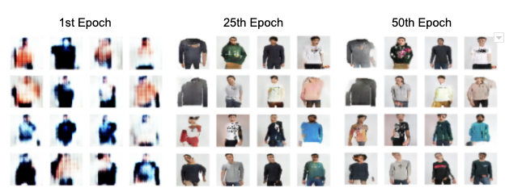

# GANs in Art and Design
This repo contains the Colab notebooks for the GAN series on [PyImageSearch](https://www.pyimagesearch.com/) which is many people's go to place for learning about computer vision, deep learning and OpenCV. These posts are also part of the [PyImageSearch University](https://www.pyimagesearch.com/pyimagesearch-university/) courses where you can access both the tutorials and videos. The GAN implementations are written in **TensorFLow 2** and **Keras**.

<h2 align="center">Table of Contents</h2>

|Blog Post Title                   | Tweet |Tutorial  |Open in Colab |
|-----------------------------------|-----|--------- |----- |
|[1. Intro GANs](#1-intro-to-gans) | [Link](https://twitter.com/PyImageSearch/status/1437417053829402624?s=20) |[Link](https://www.pyimagesearch.com/2021/09/13/intro-to-generative-adversarial-networks-gans/)  | N/A  |
|[2. Get Started: DCGAN for Fashion-MNIST](#2-dcgan-fashion-mnist)|[Link](https://twitter.com/PyImageSearch/status/1458812104262262792?s=20) | [Link](https://www.pyimagesearch.com/2021/11/11/get-started-dcgan-for-fashion-mnist/)  | [Link](https://colab.research.google.com/github/margaretmz/GANs-in-Art-and-Design/blob/main/2_dcgan_fashion_mnist.ipynb)|
|[3. GAN Training Challenges: DCGAN for Color Images](#3-dcgan-zalando-fashion) | [Link](https://twitter.com/PyImageSearch/status/1470409451433771014?s=20)|[Link](https://www.pyimagesearch.com/2021/12/13/gan-training-challenges-dcgan-for-color-images/) | [Link](https://colab.research.google.com/github/margaretmz/GANs-in-Art-and-Design/blob/main/3_dcgan_color_images.ipynb)   |

## 1. Intro to GANs
Read my [Intro to GANs tutorial](https://www.pyimagesearch.com/2021/09/13/intro-to-generative-adversarial-networks-gans/) to learn how GANs work and a brief intro to the GAN variants and applications.

    

## 2. DCGAN Fashion-MNIST
Read [Get Started: DCGAN for Fashion-MNIST](https://www.pyimagesearch.com/2021/11/11/get-started-dcgan-for-fashion-mnist/) to learn how to implement a DCGAN to generate gray-scale (`28x28x1`) Fashion-MNIST like images.

    

## 3. DCGAN Zalando Fashion

Read this [GAN Training Challenges: DCGAN for Color Images ](https://www.pyimagesearch.com/2021/12/13/gan-training-challenges-dcgan-for-color-images/) to learn how to use GCGAN to generate color (`64x64x3`) fashion images. 

    

### Copyright
Please note that any content, artwork or code in this repo is licensed under a [
Creative Commons Attribution-NonCommercial 4.0 International License](https://creativecommons.org/licenses/by-nc/4.0/), which means you are free to share and adapt it, under the condition that you give appropriate credit to the author and you may not use it for commercial purposes.